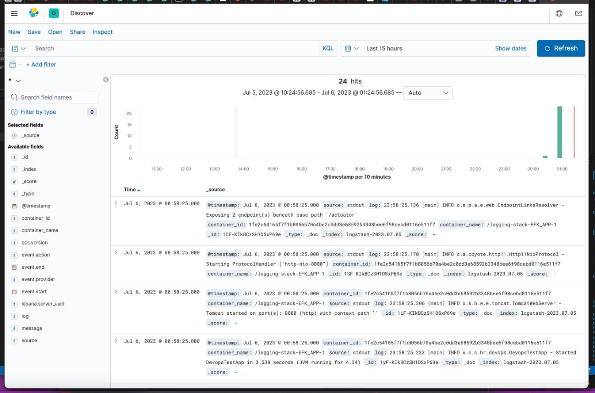
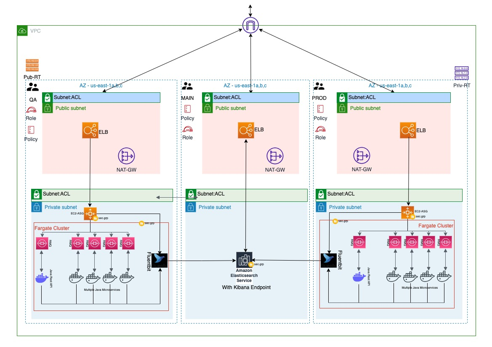

# DEVOPS ENGINEER TEST REPORT 
#

# 1. Code Test
## 1.0 

### Familiarizing with the Project

I built the provided java based application with maven and ran the resulting jar artifact. During the build stage, unit tests was skipped as per the instructions. 

```
# Commands executed
cd my-api/
mvn clean install -DskipTests | tee 1.0.1_log.txt
```

In your terminal, run the above command in the same folder where you have the pom.xml file and the output log file.
Here, `mvn clean install`  removes any previous target file and its content while building a new jar artifact.
`-DskipTests` command bypasses unit tests during the build stage. `| tee 1.0.1_log.txt file` saves the full output log into the `1.0.1_log.txt` file

```
cd target/
java -jar my-api-1.0.0.1591234567.jar | tee .. 1.0.2_log.txt
```

Change the directory to your target folder where you have your jar file and ensure your output log file is in the same folder as your jar file. In this command, `java -jar my-api-1.0.0.1591234567.jar` runs the jar artifact while  `| tee .. 1.0.2_log.txt` sends the full output log to `1.0.2_log.txt`.
Output log files `1.0.1_log.txt` and `1.0.2_log.txt`are stored in `my-api/` folder.
list of output logs for 1.0: 
 #### 1.0.1_log.txt 
 #### 1.0.2_log.txt
#

## 1.1
### CI Pipeline Deliverables

1. Make sure you are in the my-api folder. I created a shell script `updatepom.sh` in the same location where you have the pom.xml file. See the updatepom.sh script for a detailed description of the script commands.

2. To prevent permission issues, I enabled executable permissions by running this command: 
```
chmod +x updatepom.sh
```

3. I entered the command:
```
./updatepom.sh pom.xml | tee 1.1.1_log.txt
```
`./updatepom.sh pom.xml` runs the script and applies the update to the `pom.xml` file. I saved the full output log of the script with the `| tee 1.1.1_log.txt` argument.

4. Running the script achieved the following: 
    ##### i. the pom.xml file version and epoch timestamp were updated, 
    ##### ii. the java code was built, creating a target folder where the jar artifact was deployed, 
    ##### iii. the jar artifact was started as required

5. List of output logs for 1.1: 
    ##### 1.1.1_log.txt  
#

## 1.2 
### Docker 

1. `docker-maven-plugin` uncommented in `pom.xml` file
2. docker folder created in `my-api/src/main/` and `Dockerfile` defined in `my-api/src/main/docker/`

### Instructions for Building and Running the Project
1. Add  `<directory>${project.basedir}/src/main/docker/target/</directory>`  project-based directory parameter in the `pom.xml` file at `line 32` to tell maven where to create the target folder and deploy the jar file during the build stage. Recall we created a **Dockerfile** in the `src/main/docker` folder to enable the artifact to be containerized since the target folder will be in the same location as the **Dockerfile**.

2. Add your **AWS ECR image address** in the `pom.xml` through the `imageName` parameter. See `lines 74-76` of the `pom.xml` file.
3. Pass your **repository url** in `line 86`.
4. Add the `pushImage` parameter with a value of `true` in `line 97`
5. log in to your container repository (dockerhub.io or AWS ECR). 
6. To log in to dockerhub.io, enter `docker login` in your terminal and provide your username and password.
7. To log in to AWS ECR, navigate to your AWS ECR page, and select your repository (public or private) to activate the **view push command**. click on the `view push command`
8. Copy the first command:
```
aws ecr get-login-password --region YOUR_AWS_REGION | docker login --username AWS --password-stdin YOUR_AWS_ACCOUNT_ID.dkr.ecr.us-east-1.amazonaws.com
```
to retrieve an authentication token and authenticate your Docker client to your registry.
9. cd to the location of your pom.xml file and create two files for logging the full output of the build and run process respectively.
``` 
touch 1.2.1_log.txt
touch 1.2.2_log.txt
```
10. start the build process 
```
mvn clean install -DskipTests docker:push | tee 1.2.1_log.txt
```
11. check for the new image in your local repository:
```
docker images | tee 1.2.2_log.txt
```
Also, confirm the image is deployed to the assigned container registry. Verify in `AWS ECR` or `dockerhub.io`
11. start the container 
```
docker run -d --name=my_container_name -p 8080:8080 the_full_image_name:tag
```
12. confirm container is running: 
```
docker ps | tee 1.2.3_log.txt
```
13. list of logs in this section: 
#### 1.2.1_log.txt
#### 1.2.2_log.txt
#### 1.2.3_log.txt

#

## 1.3
### Docker compose & logging
**Prerequisites:**   
* Basic EFK stack is intended to be used locally.
* Update the project to include a new container from the image created in 1.2.
* Ensure that all the docker logs from that service are shipped into Elasticsearch by changing the container log driver configuration.

**Steps**
* cd to the logging-stack folder
* update the docker-compose.yaml file to include the image created in 1.2 (see `docker-compose.yaml` file for details)
* Ensure the fluentd-address is `localhost:24224`
* Run to create the EFK stack 
```
docker-compose up -d --build
```
* Confirm the status of the 4 containers with
```
docker ps
```
* Confirm all services are running on the same custom-bridge network (logging-stack_correvate):
```
docker network inspect logging-stack_correvate | tee custombridgenetwork.txt
```
* Access Kibana on the web browser with the following address: `http://localhost:5601`
* Click on the `Discovery` tab to see the logs as required.

**Deliverables**
* Updated logging-stack/ project according to requirements (see `docker-compose.yaml`)
* Logs generated and saved to `1.3_logs.txt` using
```
docker-compose –no-ansi logs | tee 1.3_log.txt
```
* See screenshot from Kibana log console showing log entries below.


#

# 2 - DevOps Process

When defining an SDLC for a SaaS application there are some key steps that are involved and they are:

### 1. Analyzing and Gathering Requirements
This is always the first thing to do as it involves identifying stakeholders in the Saas application, like business owners, technical teams, and users. This is the time you get to understand their roles, expectations, and responsibilities regarding the SaaS Application so you can review and analyze the compiled requirements for clarity and consistency. This way we can validate the requirements with the stakeholders to ensure they accurately represent their needs and expectations. `JIRA, CONFLUENCE, GOOGLE DOCS` are the tools you will be needing at this stage.

### 2. Architecture and design
In this stage, there will be a need to draw up a comprehensive design and architectural plan for the application and this involves designing the application's logical and physical structure, determining the programming languages, frameworks and libraries to be used, defining the **modules**, **layers**, and **interfaces** that make up the application. It is important to integrate security measures into the design to prevent unauthorized access.
We should eventually document the design and architecture decisions which include `flowcharts and technical specifications`. Some Tools used for this stage are `Lucidchart`, `draw.io`. 

### 3. Code development 
The code development stage is where the actual implementation of the SaaS application takes place, It involves writing high-quality, well-structured, and tested code that conforms to the specific parameters. Adherence to coding standards, collaboration through code reviews, and the use of version control systems and automated build pipelines ensure the reliability, maintainability, and scalability of the codebase. There are a few stages involved in code development and they are code review and quality assurance, maintenance and support, version control, and collaboration. There are a few essential tools that are needed for code development namely: **IDEs** like `visual studio code`, `intelliJ`, programming languages like `Python`, `Java`, and version control systems like `Git` and `svn`.

### 4. Continuous Integration
 This Stage focuses on the integration of code changes from multiple developers into a shared code repository and ensures that the application remains in a releasable state throughout the development process. The build tool in the `CI pipeline` depends on the language the code is written in, **java applications** are built by `maven` or `gradle`, and **javascript** by `npm`. The CI process has some key steps, the code is pushed to `github` or `gitlab`, and from there the **CI orchestrator** checks the code, the integrated build tool builds the code, tests it compiles it, and packages the code, and an **artifact** is produced. The code is then checked for security vulnerabilities using `sonarqube`, if there are any bugs it is returned to the dev team, if the code passes the test it is then pushed to an artifact repository like `NEXUS` or `JFROG`. The artifact can also be containerized by building a docker image from the artifact and pushing the image to a container registry like `dockerhub` or `AWS ECR`. Some CI orchestration tools include `Jenkins`, `CircleCi`, `TeamCity`, and `GitLab`. Other tools involved in different stages of the **CI process** include **maven** and **gradle** (java-based build tools), **sonaqube** (A code quality assurance tool that checks the code for security vulnerabilities), **gitlab** or **github** (central remote repositories where code is pushed to for teams to access), **Selenium**(for acceptance testing of the code), **Jfrog or Nexus**(artifact repository), **Dockerhub or Aws Ecr**(Container Image Registry).

### 5. Automated Testing:
 This stage is important as it helps to ensure that code changes are thoroughly tested and validated continuously. Automated testing helps catch bugs and regressions early, provides quick feedback, improves code quality, and facilitates the delivery of a reliable and high-quality **SaaS application** to end-users, There are component parts of automated testing namely, `Regression testing`, `unit testing`, `security testing`, `performance testing`, `integration testing` and `End-To-End testing` which essentially simulates the interactions of the end users, this kind of test is designed to ensure that the application user interface is working as planned.

### 6. Continuous deployment
 The **SDLC** for a SaaS application involves automating the deployment process, initiating frequent releases, reducing the time it takes for the software to get to the end users, facilitating a continuous feedback loop with users, providing rollback and roll forward capabilities, supporting advanced deployment techniques, enhancing Infrastructure as Code, integrating with monitoring and alerting, and fostering DevOps collaboration. Continuous Deployment ensures the fast and reliable delivery of new features and updates, improving the overall agility, quality, and customer satisfaction of the SaaS application. Tools used for continuous deployment include `Jenkins`, `CircleCi`, `GitLab CI/CD`, `AWS CodeDeploy`, `Github actions`.

### 7. Continuous Delivery
  This process is the same as Continous Deployment except that it requires a manual intervention to initiate the deployment to production 

### 8. Monitoring and logging
 This involves capturing and storing relevant information from the event logs and tracking and analyzing metrics and indicators. This is a crucial stage in the **SDLC** of **SaaS applications** as it offers insights and visibility into the application's health, security, performance, and availability. This is necessary to ensure that the application runs as expected. There are dedicated tools for monitoring and logging and some of them include `prometheus`(for scraping metrics), `Grafana` (For visualizing the metrics as charts, graphs, bar ,charts etc), `ELK STACK or EFK STACK` where **"F"** stands for **Fluentbit**, which does the same thing as `Logstash` in the **ELK STACK** ( for logging, this collects the logging data from the application and sends it to elastic search), `Kibana` in the **ELK stack** filters and visualizes the log data on kibana dashboard.

#

# 3 - AWS & Solution drafting

### Here are the high-level steps I will take to address the team's need for a centralized logging solution for their distributed application.
                                    

1. I will **familiarise myself with the existing setup** to get a good understanding of the current architecture. If the existing architecture is robust enough with **high availability** and **security**, I will build the new setup in the **already existing network infrastructure**. So the final infrastructure will run in the `same VPC`. I will also develop basic `Terraform` templates (if not already available)to `enable flexible deployment` of the planned infrastructure.

2. First I will set up the `AWS Elastic Search domain` to achieve a **centralized storage location** for the log data from both enviroments in the already existing setup. The infrastructure will consist of the `AWS ES domain` and `AWS Fargate running kibana and tooling apps`. To achieve `high availability`, this setup will be provisioned in **two availability zones**. To ensure network `security`, all services in this setup will be provisioned in the `private subnet` with a `loadbalancer` in  the `public subnet`, listening to incoming traffic. A `main account` will also be setup with `IAM roles` and `policy permissions` for **resources** and **users**. 

3. To avoid `downtime` in Production, I will `migrate the QA Environment`, since it is identical to PROD by resources provisioned in them. All QA team users will be moved to `PROD and assigned permissions` according to their **roles** so they can access the same resources in the PROD environment until the QA environment is fully setup.

4. During the `QA setup`, I will **increase the compute and storage resources** for the `auto-scaled EC2 instances` the PROD environment to accommodate the impact of QA testing. I will do this by increasing the number of `desired instances` in the auto-scaling group configuration. 

5. In the `QA environment`, I will replace `cloud watch with Fluentbit` and move `Fluentbit and the other existing infrastructure` to the `private subnet`. A `load balancer` in the `public subnet` will be listening and `distributing traffic` to **all applications** in the `private subnet`. The `QA environment` will be able to get regular updates and upgrades via a `NAT gateway`, connected to the `private route-table` once the setup is complete. 

6. While the `QA environment` is undergoing this migration, the `PROD environment` will continue to use `cloudwatch` until the QA is fully setup with the ability to search and read the logs in an aggregated fashion using the kibana dashboard. Once the QA setup is complete and `connected to AWS ES domain via the fluentbit configuration`, all users (QA and PROD) will be migrated to the QA environment with the necessary IAM roles and permissions assigned.
I will repeat the process from step 3 to completion for the PROD environment. This time the QA environment becomes the PROD until PROD is fully setup. 

7. Finally, the QA and PROD environments will have incoming traffic from the load balancer hitting the EC2 auto-scaled application and the applications in Fargate. The EC2 applicaton and the various applications in Fargate respond by sending messages to their respective RabbitMQ. This `service-to-service design` enables all the applications to commuinicate seamlessly with themselves. 
Since Fluentbit is now configured, it will collect logs from the different microservices and forward them to the AWS Elastic Search domain, allowing for centralized log management and analysis. Kibana in turn pulls logs from Elasticsearch for visualization and analysis.

8. The applications in all three environments will be deployed in multiple availability zones and will exist in the private subnet for security. Load balancers will be setup in the public subnet to distribute incoming traffic to the necessary applications. The NAT gateway which I will connect with the private route table to allow the applications a secure access outside the VPC when updates and upgrades are required.   



#
